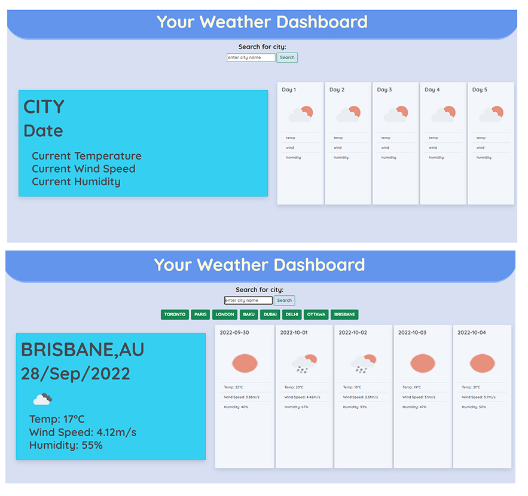

#  Module 6 : Javascript & Server Side APIs: Weather App

## Overview

I have created a weather app that returns the current weather of your desired locaton as well as the 5 future days in formatted cards with icons using information from Open Weather Map's API.

## Installation

N/A

## Usage

The page loads upon landing and you are shown placeholder cards for the 6 days in question. Entering a city and pressing enter/search will find the city and present you with weather details for the city as well as representative icons.

Previous searches will be saved as buttons for easy repeat use.

### Links

 [Github Page](https://sashdc.github.io/the-weather-report/)
 
 [Github Repo](https://github.com/sashdc/the-weather-report)

 ## Credits

Cherian, Saharsh
OpenWeatherMap API

[Creator Github](https://github.com/sashdc)

## License

N/A
